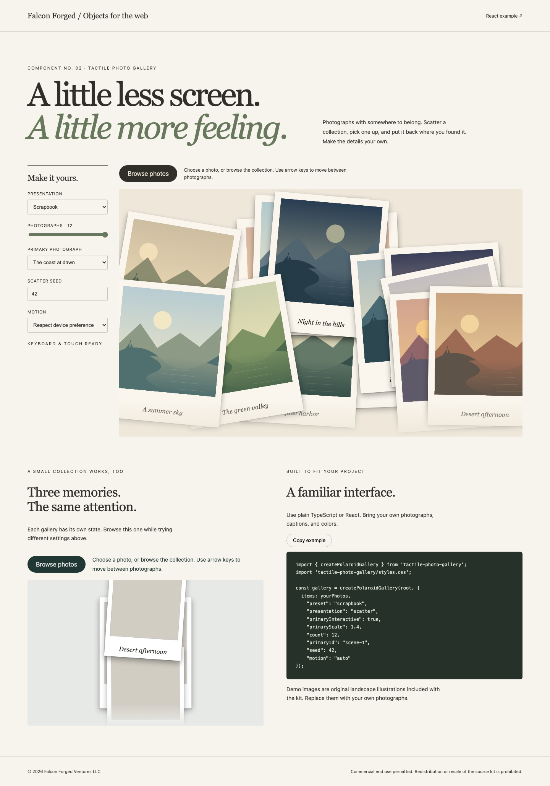

> Detailed product guide. For current installation, source availability, licensing and demo links, start with the [repository README](../README.md).

# Tactile Photo Gallery

Photographs that feel like objects: a scattered collection, a clear view, and a considered return home.

Version 1.0.0 · TypeScript + GSAP · Vanilla and React · Falcon Forged Ventures LLC

Commercial end use permitted. Redistribution or resale of the source kit is prohibited. See LICENSE.md for the full terms, including the number of permitted end products.

## Quick start

Requires Node 22.18 or later and npm. No account or service key is required.

```sh
npm ci
npm run dev
```

Open the address printed by Vite. The configurator includes Scrapbook, Portfolio, and Editorial presets. Use the React example link for the Strict Mode example.

```sh
npm run build
npm run preview
npm run pack:library
```

The installable library is written to artifacts/tactile-photo-gallery-1.1.1.tgz. Install that archive in your own app with npm install, then import the core and stylesheet. Do not deploy artifacts/ or the source checkout as public assets.

See docs/GETTING_STARTED.md, docs/API.md, docs/CUSTOMIZATION.md, docs/ACCESSIBILITY.md, and docs/TESTING.md. All sample landscapes are original SVG illustrations; replace them with photographs you have permission to use.



The draft's verification scope and remaining physical-device checks are recorded in docs/VALIDATION.md.
